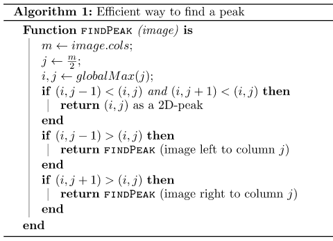

| [Fatbardh Kadriu](https://github.com/FatbardhKadriu) | [Arbena Musa](https://github.com/ArbenaMusa) |
| ---------------------------------------------------- | -------------------------------------------- |
|                                                      |                                              |

# PeakFinding

Në një matricë të dhënë mund të gjenden anëtarët kulm të saj duke i krahasuar me anëtarët fqinjë. Një anëtar i matricës A[i][j] është kulm nëse është më i madh ose baraz se fqinjët e tij A[i-1][j], A[i+1][j], A[i][j-1] dhe A[i][j+1]. Për antarët në rreshtat dhe kolonat e skajshme, fqinjët që mungojnë konsiderohen si vlera minus infinit(-∞).

```
Input : 10 20 15
        21 30 14
         7 16 32
Output : 30
```

Kërkimi i një elementi kulm në një matricë kryhet me anë të algoritmit si në vazhdim:

1. Caktohet kolona që gjendet në mes të matricës dhe kërkohet elementi me vlerën më të madhe në të.
2. Indeksi i kolonës së mesme ruhet në j, indeksi i elementit maksimal ruhet në max_element dhe vlera e tij merret nga pozita matrix[max_index][j] e matricës.
3. Nëse max_element gjendet në skaje të matricës ai është element kulm dhe vlera e tij kthehet si rezultat.
4. Nëse max_element >= matrix[max_index, j - 1] dhe max_element >= matrix[max_index, j + 1], max është element kulm dhe vlera e tij kthehet si rezultat.
5. Nëse matrix[max_index, j - 1] > matrix[max_index, j], përsëritet algoritmi për pjesën e djathtë të matricës.
6. Nëse matrix[max_index, j - 1] <> matrix[max_index, j], përsëritet algoritmi për pjesën e majtë të matricës.



Në formë grafike ky alguritëm mund të vizualizohet si në vijim:


## Kompleksiteti kohor

Nëse me T(n,m) shënohet puna e cila duhet të kryhet për të zgjidhur problemin për matricën me n rreshta dhe m kolona atëherë:

Meqë në çdo hap të aplikimit të algoritmit na përgjysmohen kolonat e matricës nëpër të cilat kërkohet një element kulm, koha që nevojitet për të kryer këtë punë është sa koha që nevojitet për ta gjetur elementin me vlerën maksimale në një kolonë të caktuar (llogaritur për n rreshta) dhe koha për ta kërkuar elementin kulm në gjysmën e caktuar të matricës që mbetet pas ndarjes.

</br>

 është koha që shpenzohet për ta kërkuar elementin maksimal në një kolonë meqë vlerat e elementeve në kolona nuk janë të sortuara.

Në hapat e radhës formula do të kishte format:

</br>

</br>

...

Një ndarje e tillë e matricës vazhdon derisa të mbetet vetëm një rresht i fundit për ta gjetur elementin me vlerë maksimale dhe ka kompleksitetin kohor:

</br>

Kompleksiteti kohor kur mbetet një kolonë e fundit është  pasiqë mbetet vetëm të gjendet elementi maksimal edhe për atë kolonë.

Formula e përgjithshme e kompleksitetit kohor mund të përkufizihet si në vijim:

</br>

Në rastet kur matrica është katrore, pra numri i rreshtave dhe i kolonave është i njejtë (n=m), kompleksiteti ka formën:

</br>

## Kompleksiteti hapësinor

Kompleksiteti hapësinor i alogritmit përcaktohet në bazë të hapësirës shtesë që shfrytëzohet. Hapësira kryesore që shfrytëzohet është ajo në të cilën duhet të ruhet matrica me dimensionet mxn dhe nuk është e nevojshme për më tepër hapësirë.

</br>
