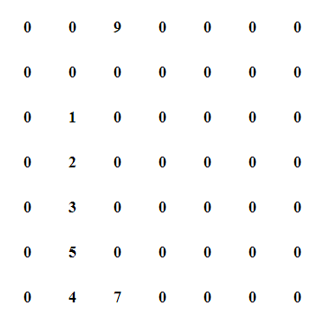
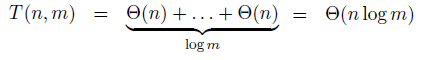

| [Fatbardh Kadriu](https://github.com/FatbardhKadriu) | [Arbena Musa](https://github.com/ArbenaMusa) |
| ---------------------------------------------------- | -------------------------------------------- |
|                                                      |                                              |

# Gjetja e anëtarit kulm në matricë

Një anëtar i matricës A[i][j] është kulm nëse është më i madh ose baraz se fqinjët e tij A[i-1][j], A[i+1][j], A[i][j-1] dhe A[i][j+1]. Për antarët në qoshe, fqinjët që mungojnë konsiderohen si vlera minus infinit(-∞).

```
Shembulli 1:
Input : 10 20 15
        21 30 14
        7  16 32
Output : 30

Shembulli 2:
Input : 0 0 9 0 0 0 0
        0 0 0 0 0 0 0
        0 1 0 0 0 0 0
        0 2 0 0 0 0 0
        0 3 0 0 0 0 0
        0 5 0 0 0 0 0
        0 4 7 0 0 0 0
Output: 5

Shembulli 3:
Input : 27 29 30 32 10 8  10 10 20 21 20
        18 20 22 24 14 13 12 11 14 15 14
        27 32 33 35 15 9  11 21 23 25 23
        42 42 44 46 18 17 19 20 26 30 26
Output: 46
```

Për gjetjen e një elementi kulm në një matricë përmes "kërkimit binar" ndjekni hapat e mëposhtëm:

- Zgjedh kolonën e mesme j = m / 2.
- Gjeni maksimumin global në kolonën j në (i, j).
- Krahasoni (i, j - 1), (i, j), (i, j + 1).
- Zgjedh kolonat majtas për (i, j - 1) > (i, j).
- Në mënyrë të ngjashme djathtas.
- (i, j) është kulmi 2D nëse nuk plotësohen asnjë prej kushteve lartë.
- Zgjidh problemin e ri me gjysmën e numrit të kolonave.
- Kur të keni një kolonë të vetme, gjeni maksimumin global dhe keni mbaruar.

Në formë grafike ky algoritëm mund të vizualizohet si në vijim (Shembulli 2):



## Kompleksiteti kohor

Nëse me T(n,m) shënohet puna e cila duhet të kryhet për të zgjidhur problemin për matricën me n rreshta dhe m kolona atëherë:

Meqë në çdo hap të aplikimit të algoritmit na përgjysmohen kolonat e matricës nëpër të cilat kërkohet një element kulm, koha që nevojitet për të kryer këtë punë është sa koha që nevojitet për ta gjetur elementin me vlerën maksimale në një kolonë të caktuar (llogaritur për n rreshta) dhe koha për ta kërkuar elementin kulm në gjysmën e caktuar të matricës që mbetet pas ndarjes.

</br>

 është koha që shpenzohet për ta gjetur elementin maksimal në një kolonë.

Në hapin e radhës formula do të kishte formën:

</br>

dhe kështu vazhdon për T(n, m/4), T(n, m/8), ...

Një ndarje e tillë e matricës vazhdon derisa të mbetet vetëm një kolonë e fundit për ta gjetur elementin me vlerë maksimale dhe ka kompleksitetin kohor:


Formula e përgjithshme e kompleksitetit kohor mund të përkufizihet si në vijim:



Në rastet kur matrica është katrore, pra numri i rreshtave dhe i kolonave është i njejtë (n=m), kompleksiteti ka formën:

</br>

## Kompleksiteti hapësinor

Kompleksiteti hapësinor i algoritmit përcaktohet në bazë të hapësirës shtesë që shfrytëzohet. Për gjetjen e elementit kulm kompleksiteti hapësinor është konstant O(1).
